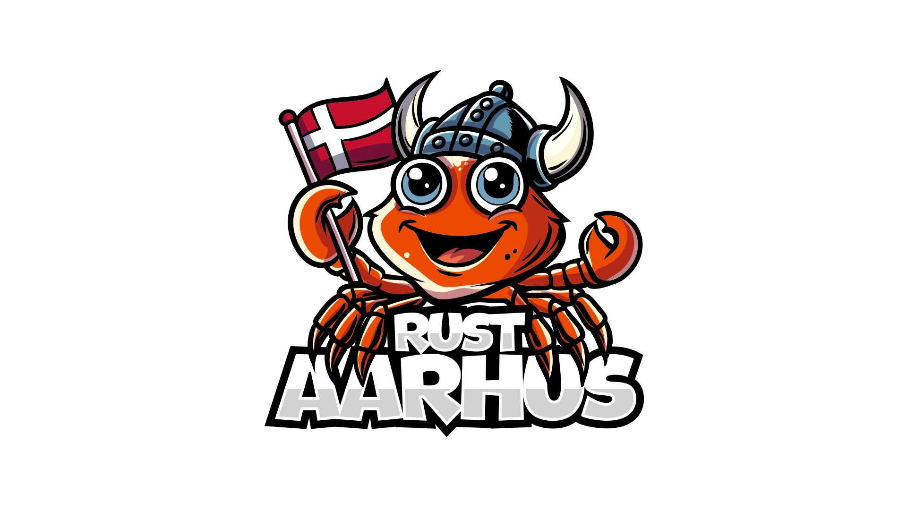

# Rust Aarhus Meetups

Rust Aarhus is a user group for the programming language named Rust. The user group will arrange events in the area of Aarhus, Denmark.

## Preparing a talk
If you need information about preparing a talk, you should look [here](talks.md). 

To propose a new talk, please find an event issue and create a sub-issue for your talk (use the template "Talk Proposal").

You will find event issues where we are still looking for talks right [here][call-for-papers].

## Sponsoring a meetup
If you would like to sponsor a meetup, you will find a list of meetups without a sponsor here [here][needs-sponsor].

Feel free to comment on the event issue you would like to sponsor or contact one of the organizers.

## Community tasks
We have some tasks to be solved by our great community. If you would like to do something but there is no task for it, feel free to create one or discuss it with one of the organizers. Please find the list of open tasks right [here][issues-task].

## Open positions
If you want to contribute more regularly, we have a few roles available. If interested, please reach out to Tue Henriksen.

### SoMe responsible(s)
For all our meetups, we need to advertise on social media. Currently, we have been most active on LinkedIn, but we might not be reaching the people on X, Mastodon, Reddit, etc.

### Graphical designer
It would be great if we had individual graphics work for our meetups. The reason is when publishing meetups on social media platforms, it will just show our logo, and it is hard for people to distinguish between different meetups. This can be changed if we have different graphics designs for each meetup.

## Code of Conduct
In Rust Aarhus, everyone is welcome and should feel welcome. For this reason, we follow the [Berlin Code of Conduct][berlin-coc].

## Communication Channels
New meetups are announced on [meetup].

You can communicate with the organizers through meetup.com or via our Matrix channel.

[berlin-coc]: https://berlincodeofconduct.org/
[meetup]: https://www.meetup.com/rust-aarhus/
[call-for-papers]: https://github.com/orgs/rust-aarhus/projects/1/views/9
[needs-sponsor]: https://github.com/orgs/rust-aarhus/projects/1/views/8
[issues-task]: https://github.com/rust-aarhus/meetups/labels/task
